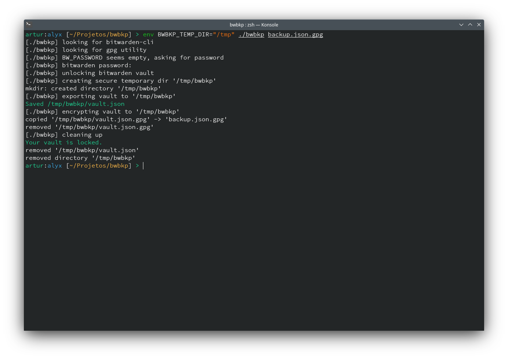

# bwbkp

A small shell script utility to backup your BitWarden vault

bwbkp uses pure shell script to backup your vault as an encrypted JSON using GPG AES256 and your own vault password

# FAQ

## Why should I trust your script?

**You shoudn't**, with something as sensitive as your password vault you should be extremely careful, thats the whole reason i've wrote this script, its simple enough that you can audit it etirely by yourself, and you should.Also, i've commented and logged every section to make it easy to understand what is going on.

## Is this safe?

**It's not**. I don't want to make you worry but you need to trust a lot of stuff in order to this or any script to work safely like the binary executable of both `bw` and `gpg`, the fact that it uses tmpfs by default, any program thats reading your environment variables and so on. Its safe enough that unless you're not a high value target and you took the basic security measurements on your system you should be safe.

## What is the 'clientid' and 'clientsecret' requested?

bwbkp uses API Key authentication, that is done for security reason among other things. Its what bitwarden recommends when using the CLI utility. You can get it from your bitwarden web vault by clicking in your profile icon and going to **Account Settings > Security > Keys > View API Key**. If you still have doubts, check out [bitwarden official docs](https://bitwarden.com/help/cli/#using-an-api-key).

## How do I "restore" a backup

I don't have plans to make a restore tool since it has some risks of overriding your bitwarden vault, but the backup is a simple json cryptographed export. You can unencrypt by using gpg with `gpg -d yourfile.json.gpg` and your vault will spill your plain text on screen. You can save that to a json file and import back to bitwarden using any UI or do whatever you want to do.

## My vault is already logged in on bitwarden-cli

bwbkp will check if your vault is logged in with bitwarden-cli, it will only prompt for clientid / clientsecret if your vault is not logged in. Multiple vaults connected with bitwarden-cli aren't supported yet. bwbkp wont logout your vault.

So you can login with `bw login` or `bw login --apikey` before running bwbkp and it wont ask for your login info again.

Check out [bitwarden-cli login documentation](https://bitwarden.com/help/cli/#log-in) for more information.

## Can I automate bwbkp on a script?

**Yes**, the login process can be automated trought the default login methods of bitwarden-cli as stated above. But your password will be asked every time, thats because your vault is logged in but its locked. Thats for safety. But you can supply your password trought two other methods.

The first is the `BW_PASSWORD` environment variable, if this variable is set it will be used to unlock your bitwarden vault and to encrypt your backup. This method is not recommended because reading environment variables is easy and you may need to write your master password on an unsafe file in order to run bwbkp.

The second is the `BW_PASSWORD_FILE` environment variable. Which points to a file where your password is stored, this method is recommended because you can protect your password behind your operating system permission manager. As long as the user running bwbkp has permission to read this file it can get the password and process totally unattended.

> Saving your password on a environment variable or on a file is less secure than typing it manually every time, be aware that your master password is saved in plain text and anyone with access to this user can read your password

> Its very important to set the correct permissions to your master password file in order to make it secure against any user accessing that device. I recommend you to set the owner of the file the person that will run bwbkp and make it with read-only permission to that user and no permissions to anyone else (mode 400).

## Why bwbkp needs my master password?

To unlock your vault, there's no other way to access your vault than with your master password, so it's necessary to pass it to bitwarden-cli. You can check the entire process. Your password is only saved in the `PASSWORD` and `BW_PASSWORD` variables

## Why bwbkp uses tmpfs?

That is to avoid needing user escalation (root / sudo) since those are the only users that can create a mountpoint. So bwbkp uses a already mounted temporary directory like /tmp or /dev/shm and your OS permission system to make sure its not accessed while its being encrypted.

tmpfs is not safe because it may swap part of your vault to your swapfile, thats why its not recommended to run bwbkp on a multi user system. Ramfs is safer because it doesn't swap but theres no ramfs available by default on unix systems.

If you want to be safer you can use the `BWBKP_TEMP_DIR` environment variable to set a previously mounted ramfs folder. **AVOID POINTING THE TEMP DIRECTORY TO A PHYSICAL DISK** since data can be recovered from physical disks after the file being deleted.

bwbkp will use your home directory as a last resort if it cannot find any temp dir on your system. Thats not ideal.

## How is my backup cryptographed?

Your backup is saved formmated in json using [GnuPG](https://gnupg.org/) with a symmetrical AES256 encryption and your master password as key, saved locally as a `json.gpg` file.

## What is the license of bwbkp?

This software is licensed under the [Mozilla Public License v2](https://mozilla.org/MPL/2.0/) and its compatible with secondary licenses.

> This Source Code Form is subject to the terms of the Mozilla Public
> License, v. 2.0. If a copy of the MPL was not distributed with this
> file, You can obtain one at https://mozilla.org/MPL/2.0/.
